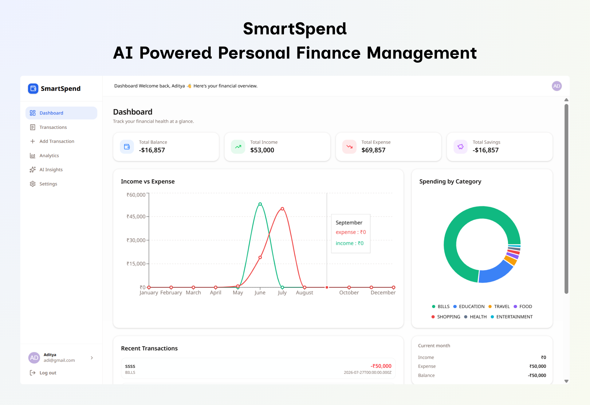
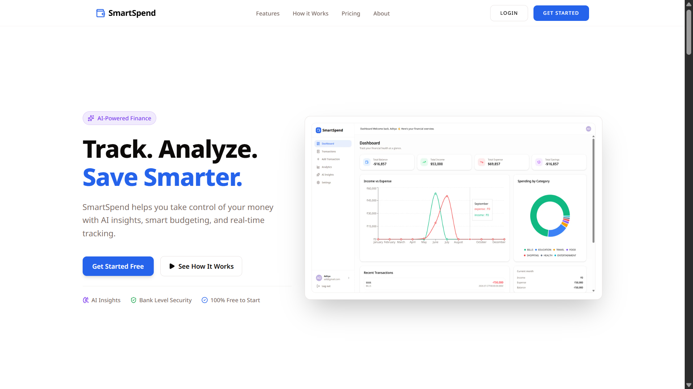
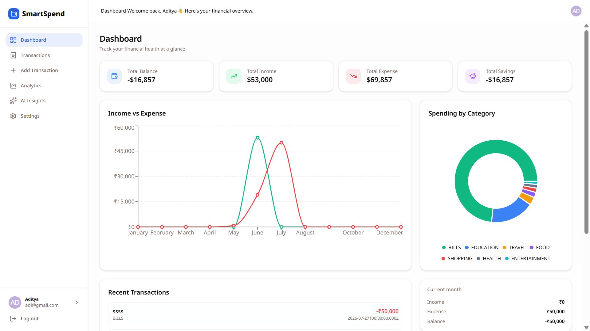
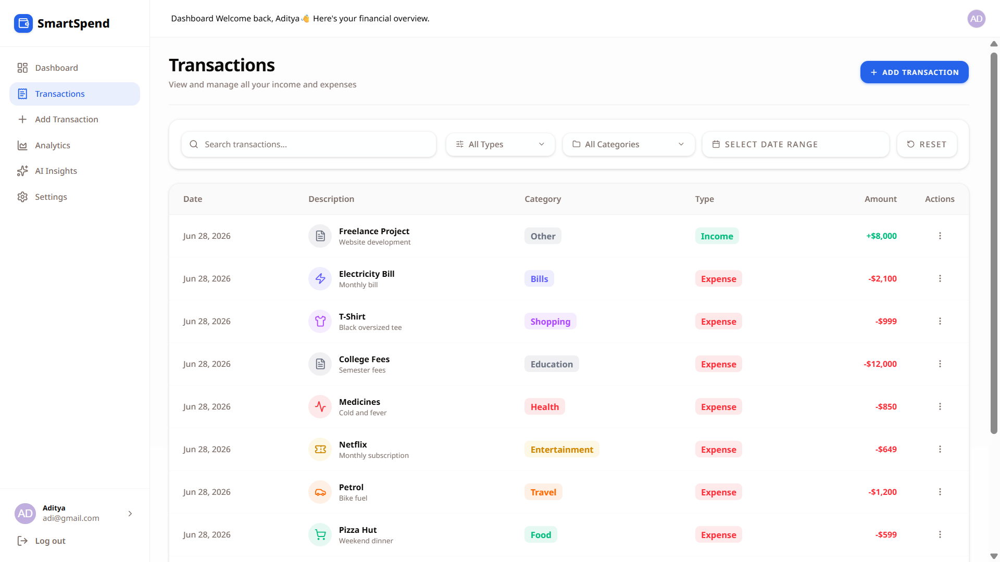
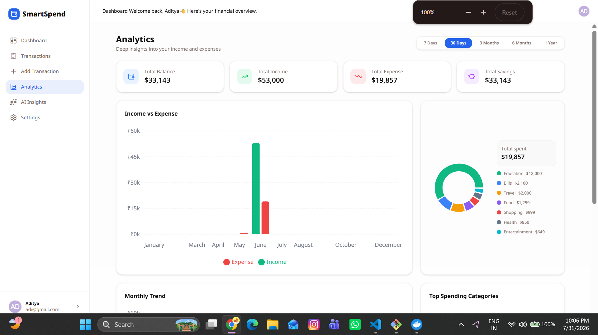
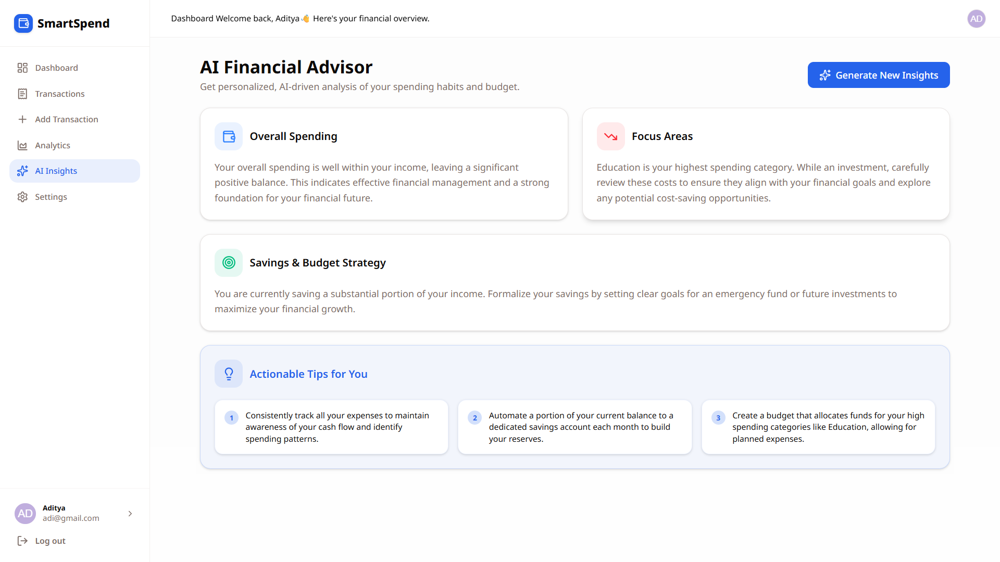
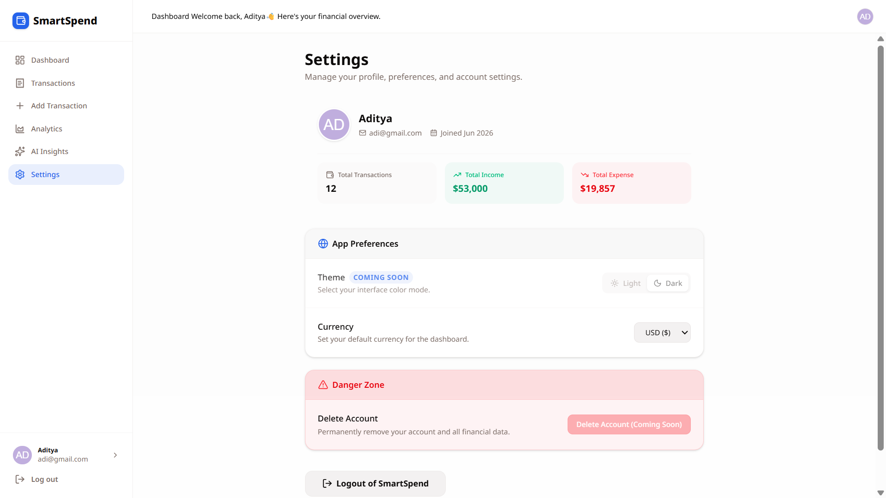

# 💸 SmartSpend

<p align="center">
  
</p>

<h3 align="center">
AI-Powered Personal Finance Management Platform
</h3>

<p align="center">
Track your income and expenses, analyze spending patterns with interactive analytics, and receive personalized AI-powered financial insights to make smarter financial decisions.
</p>

## 🌐 Live Demo

| Application | Link |
|------------|------|
| Frontend | Coming Soon |
| Backend API | Coming Soon |

<p align="center">


</p>

---

## ✨ Overview

SmartSpend is a modern full-stack personal finance management platform that enables users to manage their finances efficiently through powerful analytics and AI-driven insights.

It provides a clean dashboard, advanced transaction management, detailed analytics, and personalized financial recommendations powered by Google Gemini AI.

## ✨ Highlights

- 🤖 AI-powered financial insights using Google Gemini
- 📊 Interactive analytics dashboard
- 💸 Complete transaction management (CRUD)
- 🔐 Secure JWT authentication
- 📱 Fully responsive modern UI
- ⚡ Built with Next.js, Express, Prisma & PostgreSQL

## 🚀 Project Status

🟢 Actively Maintained

✅ Frontend Completed

✅ Backend Completed

✅ AI Integration Completed

✅ Production Build Passing

✅ ESLint Passing

## ✨ Features

### 🔐 Authentication

- Secure User Registration & Login
- JWT Authentication
- HTTP-Only Cookie Authentication
- Protected Routes
- Persistent User Session

---

### 💸 Transaction Management

- Add Income & Expense Transactions
- Edit Existing Transactions
- Delete Transactions
- Search Transactions
- Filter by Type
- Filter by Category
- Filter by Date Range
- Server-side Pagination

---

### 📊 Dashboard

- Total Balance Overview
- Total Income
- Total Expenses
- Recent Transactions
- Monthly Income vs Expense Chart
- Category-wise Expense Distribution
- Current Month Financial Summary

---

### 📈 Analytics

- Monthly Spending Trends
- Income vs Expense Comparison
- Expense Distribution by Category
- Financial Quick Insights
- Spending Pattern Analysis

---

### 🤖 AI Financial Insights

Powered by **Google Gemini AI**

The AI analyzes your financial data and provides:

- Spending Analysis
- Budget Recommendations
- Saving Suggestions
- Overspending Detection
- Personalized Financial Tips

---

### ⚙️ User Experience

- Fully Responsive Design
- Modern Dashboard UI
- Loading Skeletons
- Toast Notifications
- Profile & Settings
- Fast Navigation

---

### 🛡️ Backend Features

- RESTful API
- Layered Architecture
- Prisma ORM
- Zod Validation
- Global Error Handling
- Service-Based Architecture
- AI Prompt Builder
- Clean TypeScript Code

## 📸 Application Preview

### 🏠 Landing Page

<p align="center">
  
</p>

---

### 📊 Dashboard

<p align="center">
  
</p>

---

### 💸 Transaction Management

<p align="center">
  
</p>

---

### 📈 Analytics

<p align="center">
  
</p>

---

### 🤖 AI Insights

<p align="center">
  
</p>

---

### ⚙️ Settings & Profile

<p align="center">
  
</p>

## 🛠️ Tech Stack

| Category | Technologies |
|----------|--------------|
| **Frontend** | Next.js 16, React 19, TypeScript, Tailwind CSS, shadcn/ui, Lucide React |
| **Backend** | Node.js, Express.js, TypeScript |
| **Database** | PostgreSQL, Prisma ORM |
| **Authentication** | JWT, HTTP-Only Cookies, bcrypt |
| **Validation** | Zod |
| **Charts & Analytics** | Recharts |
| **AI** | Google Gemini AI |
| **Deployment** | Coming Soon |
| **DevOps** | Docker, Docker Compose |
| **Version Control** | Git & GitHub |

## 🏗️ Architecture

```text
 Next.js Frontend
        │
        ▼
 Express REST API
        │
   Prisma ORM
        │
 PostgreSQL
        │
 Google Gemini AI
```

## 📂 Project Structure

```text
SmartSpend/
│
├── client/                     # Next.js Frontend
│   ├── app/
│   ├── components/
│   ├── constants/
│   ├── context/
│   ├── hooks/
│   ├── lib/
|   ├── public/
│   ├── services/
│   ├── types/
│   ├── utils/
│   └── Validator/
│
├── server/                     # Express Backend
│   ├── prisma/
│   └── src/
│       ├── config/
│       ├── constants/
│       ├── controllers/
│       ├── lib/
│       ├── middlewares/
│       ├── providers/
│       ├── routes/
│       ├── services/
│       ├── utils/
│       ├── validators/
|       ├── index.js
│       └── app.js
│   
│   
│
├── docker-compose.yml
└── README.md
```

### 📦 Architecture Overview

- **client/** → Modern Next.js frontend with App Router.
- **server/** → Express.js REST API following a layered architecture.
- **Prisma** → Database access layer for PostgreSQL.
- **Gemini Provider** → Generates AI-powered financial insights.
- **Docker** → Simplifies local development with PostgreSQL.

## 🚀 Getting Started

Follow these steps to run SmartSpend locally.

### 1️⃣ Clone the Repository

```bash
git clone https://github.com/adityathakur2008/SmartSpend.git
cd SmartSpend
```

---

### 2️⃣ Setup the Backend

```bash
cd server
npm install
```

---

### 3️⃣ Configure Environment Variables

Create a `.env` file inside the `server` directory.

```env
DATABASE_URL=

JWT_SECRET=

GEMINI_API_KEY=

GEMINI_MODEL=
```

---

### 4️⃣ Start PostgreSQL with Docker

```bash
docker compose up -d
```

---

### 5️⃣ Generate Prisma Client

```bash
npx prisma generate
```

---

### 6️⃣ Run Database Migrations

```bash
npx prisma migrate dev
```

---

### 7️⃣ Start the Backend Server

```bash
npm run dev
```

The backend will be running at:

```text
http://localhost:5000
```

---

## 💻 Setup the Frontend

Open another terminal.

```bash
cd client
npm install
```

Create a `.env.local` file.

```env
NEXT_PUBLIC_API_URL=http://localhost:5000/api
```

Start the frontend.

```bash
npm run dev
```

The frontend will be available at:

```text
http://localhost:3000
```

---

## 🏗️ Production Build

### Backend

```bash
npm start
```

### Frontend

```bash
npm run build
npm start
```

## ✅ Requirements

- Node.js 20+
- PostgreSQL
- Docker & Docker Compose
- Google Gemini API Key

## 🚀 Future Improvements

The following features are planned for future releases:

- Budget Planning
- Recurring Transactions
- Smart Budget Alerts
- Export Reports (PDF & CSV)
- AI Chat Assistant
- Email Reports
- Multi-Currency Support
- PWA Support
- Push Notifications

## 🤝 Contributing

Contributions, issues, and feature requests are welcome.

If you'd like to improve SmartSpend:

1. Fork the repository
2. Create a new feature branch
3. Commit your changes
4. Push your branch
5. Open a Pull Request

## 👨‍💻 Author

**Aditya Thakur**

- GitHub: [AdityaThakur2008](https://github.com/AdityaThakur2008)
- LinkedIn: [aditya-thakur08](https://www.linkedin.com/in/aditya-thakur08)
- Email: adityathakur89362@gmail.com

## 📄 License

This project is licensed under the MIT License.


## ⭐ Support

If you found this project helpful, please consider giving it a ⭐ on GitHub.

It helps others discover the project and motivates future development.

## 🙏 Acknowledgements

This project was built as a personal learning project to strengthen my Full Stack Development skills while exploring AI integration in modern web applications.

Special thanks to the open-source community and the creators of Next.js, Prisma, shadcn/ui, Docker, and Google Gemini.